# Bank Statement Analytics Platform
## Industry Standard & Production Level
---

## Project Snap Shots 

### *Home-page*

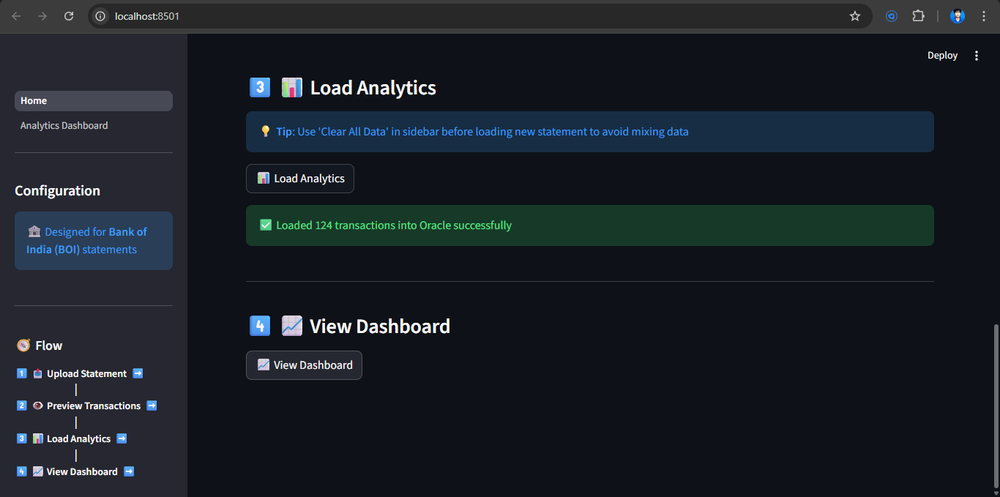

### *Dashboard-page*

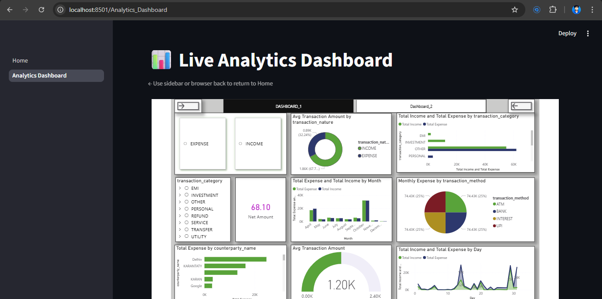

## Table of Contents

1. [Project Overview](#project-overview)
2. [Prerequisites](#prerequisites)
3. [Implementation Roadmap](#implementation-roadmap)
4. [Step-by-Step Setup Guide](#step-by-step-setup-guide)
5. [PowerBI Configuration](#powerbi-configuration)
6. [Deployment Process](#deployment-process)
7. [Testing & Validation](#testing--validation)
8. [Monitoring Setup](#monitoring-setup)
9. [Production Upgrade Path](#production-upgrade-path)
10. [Troubleshooting](#troubleshooting)

---

## Project Overview

### What This Project Delivers

A production-grade, privacy-first analytics platform where users upload bank statements, receive automated insights through PowerBI dashboards, and benefit from automatic data cleanup after 30 minutes. Built with industry-standard architecture patterns and cloud services.

### Key Learning Outcomes

**Technical Skills Acquired:**
- Cloud infrastructure setup and management
- RESTful API development with FastAPI
- Asynchronous event-driven processing
- ETL pipeline implementation
- Business Intelligence integration
- Clean architecture implementation
- CI/CD pipeline configuration
- Database design and optimization

**Industry Practices Learned:**
- Microservices architecture
- Repository pattern implementation
- Dependency injection
- Session-based data isolation
- Privacy-first design principles
- GDPR compliance mechanisms
- Production monitoring strategies
- Cost optimization techniques

### Architecture Summary

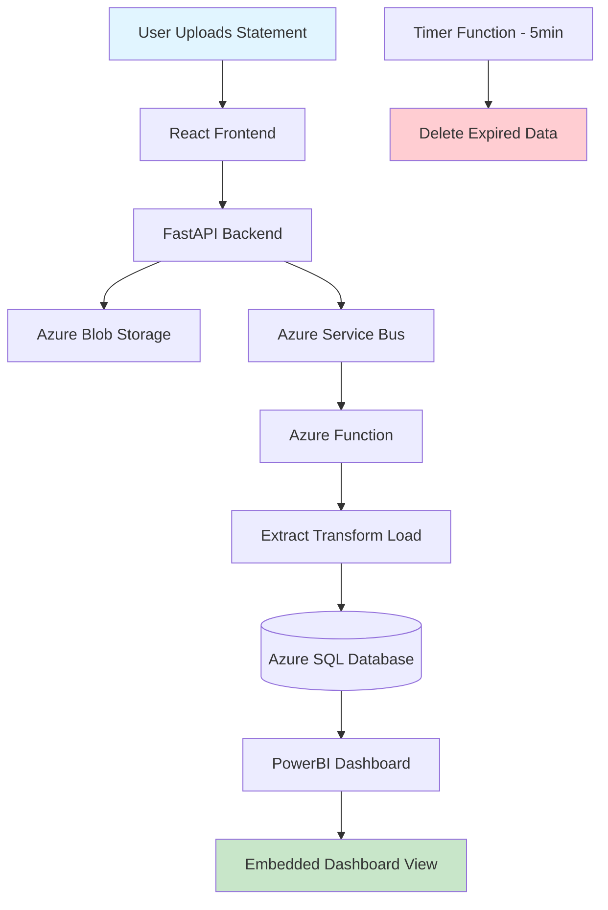

---

## Prerequisites

### Required Accounts & Tools

**Cloud & Services:**
- Azure Account with free credits
- GitHub Account (for version control)
- Vercel Account (for frontend hosting - free tier)
- Supabase Account OR PlanetScale (for database - free tier)

**Software Installation:**
- Node.js 18+ and npm
- Python 3.10+
- Git
- Azure CLI
- PowerBI Desktop (free download)
- VS Code or preferred IDE

**Knowledge Requirements:**
- Basic Python programming
- React.js fundamentals
- REST API concepts
- SQL basics
- Git version control

### Account Setup Checklist

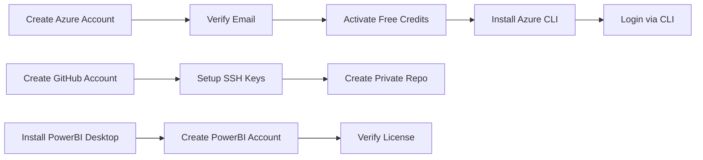

---

## Implementation Roadmap

### Phase 1: Local Development Setup (Week 1)

**Day 1-2: Environment Setup**
- Install all required software
- Configure development environment
- Create project folder structure
- Initialize Git repository
- Setup virtual environment for Python

**Day 3-4: Backend Development**
- Create FastAPI application structure
- Implement domain layer (processors, interfaces)
- Build service layer (statement service, cleanup service)
- Create repository interfaces
- Setup dependency injection

**Day 5-6: Frontend Development**
- Initialize React project with Vite
- Create upload component
- Build dashboard view component
- Implement session timer
- Setup API integration

**Day 7: Local Testing**
- Test file upload functionality
- Validate processing logic
- Check data transformations
- Review error handling

### Phase 2: Database & Storage Setup (Week 2)

**Day 1-2: Database Configuration**
- Choose database provider (Supabase/PlanetScale)
- Create database instance
- Design and create tables
- Setup indexes
- Configure connection strings

**Day 3-4: Azure Storage Setup**
- Create Azure Storage Account
- Configure Blob containers
- Setup access policies
- Test file upload/download
- Configure lifecycle policies

**Day 5-7: Data Pipeline Testing**
- Test extract functionality (PDF/CSV/Excel)
- Validate data cleaning logic
- Verify transformation accuracy
- Test database inserts
- Check cascade deletes

### Phase 3: PowerBI Integration (Week 2-3)

**Day 1-2: Dashboard Design**
- Install PowerBI Desktop
- Connect to database
- Create data model
- Design visualizations
- Configure DirectQuery mode

**Day 3-4: Dashboard Publishing**
- Publish to PowerBI Service
- Generate embed code
- Test public sharing
- Configure refresh schedules
- Validate real-time updates

**Day 5: Frontend Integration**
- Embed PowerBI iframe
- Test dashboard loading
- Verify session filtering
- Check responsive design

### Phase 4: Azure Functions Setup (Week 3)

**Day 1-2: Processing Function**
- Create Azure Function App
- Setup Service Bus trigger
- Implement processing logic
- Configure environment variables
- Test with sample files

**Day 3-4: Cleanup Function**
- Create timer-triggered function
- Implement cleanup logic
- Test session expiration
- Verify data deletion
- Check blob cleanup

**Day 5: Queue Configuration**
- Setup Azure Service Bus
- Create queue
- Configure connection strings
- Test message flow
- Monitor executions

### Phase 5: Deployment (Week 4)

**Day 1-2: Backend Deployment**
- Deploy API to Azure App Service
- Configure environment variables
- Setup custom domain (optional)
- Enable HTTPS
- Test API endpoints

**Day 3-4: Frontend Deployment**
- Deploy to Vercel
- Configure environment variables
- Setup custom domain (optional)
- Enable HTTPS
- Test complete flow

**Day 5: CI/CD Setup**
- Create GitHub Actions workflows
- Configure deployment secrets
- Test automated deployment
- Setup branch protection
- Document deployment process

### Phase 6: Testing & Monitoring (Week 4)

**Day 1-2: Integration Testing**
- Test complete user flow
- Validate error scenarios
- Check data accuracy
- Test session expiration
- Verify cleanup process

**Day 3-4: Monitoring Setup**
- Configure Application Insights
- Setup custom metrics
- Create alerts
- Test logging
- Review dashboards

**Day 5: Performance Optimization**
- Analyze response times
- Optimize database queries
- Review function execution
- Check memory usage
- Document findings

---

## Step-by-Step Setup Guide

### 1. Azure Resource Provisioning

**Resource Creation Flow:**

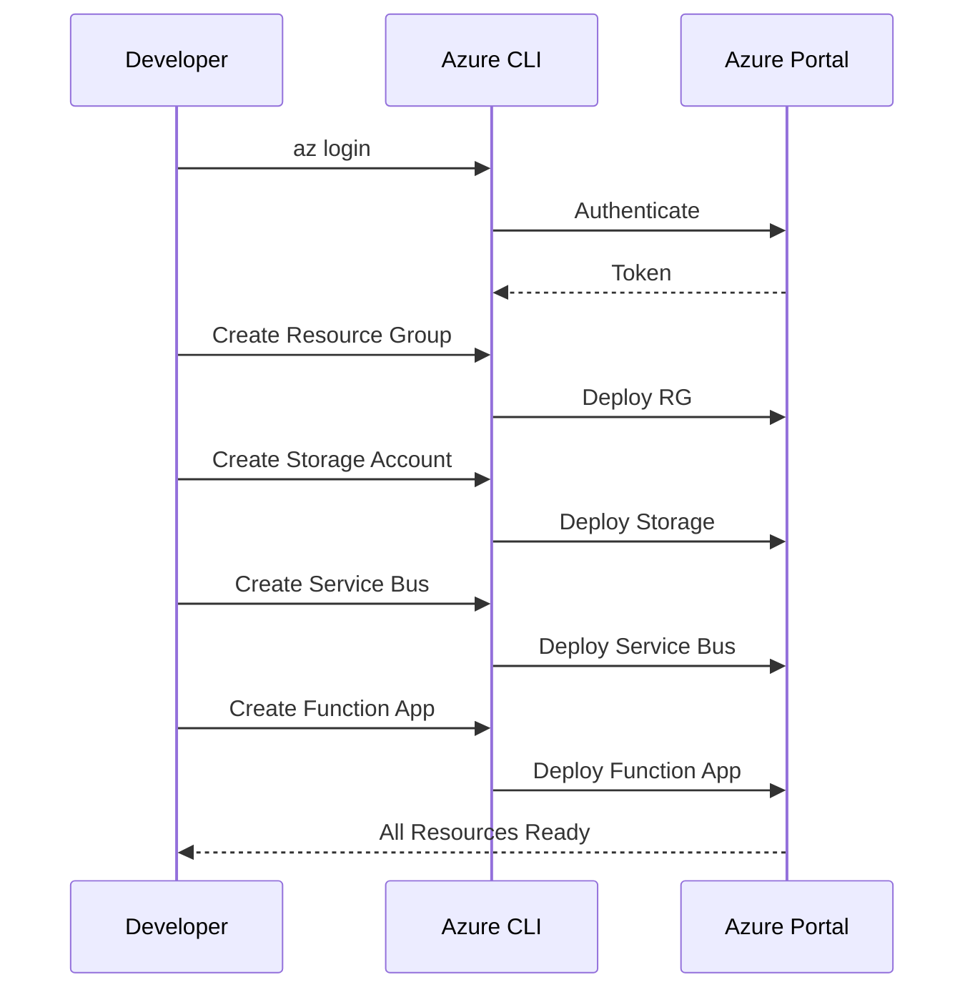

**Steps:**

1. **Login to Azure**
   - Open terminal
   - Run Azure CLI login command
   - Complete browser authentication
   - Verify subscription access

2. **Create Resource Group**
   - Choose region (e.g., East US)
   - Name: `bank-analyzer-rg`
   - Note resource group name for later use

3. **Create Storage Account**
   - Name: `bankstatementstorage` (must be unique)
   - SKU: Standard_LRS (free tier eligible)
   - Create container: `statements`
   - Enable encryption at rest

4. **Create Service Bus Namespace**
   - Name: `bank-analyzer-bus`
   - Pricing tier: Basic (free tier)
   - Create queue: `statement-processing`
   - Note connection string

5. **Create Function App**
   - Name: `bank-analyzer-functions`
   - Runtime: Python 3.10
   - Hosting: Consumption Plan (free tier)
   - Link to storage account

6. **Create App Service (API)**
   - Name: `bank-analyzer-api`
   - Runtime: Python 3.10
   - Plan: F1 Free tier
   - Enable HTTPS only

### 2. Database Setup

**Database Configuration Options:**

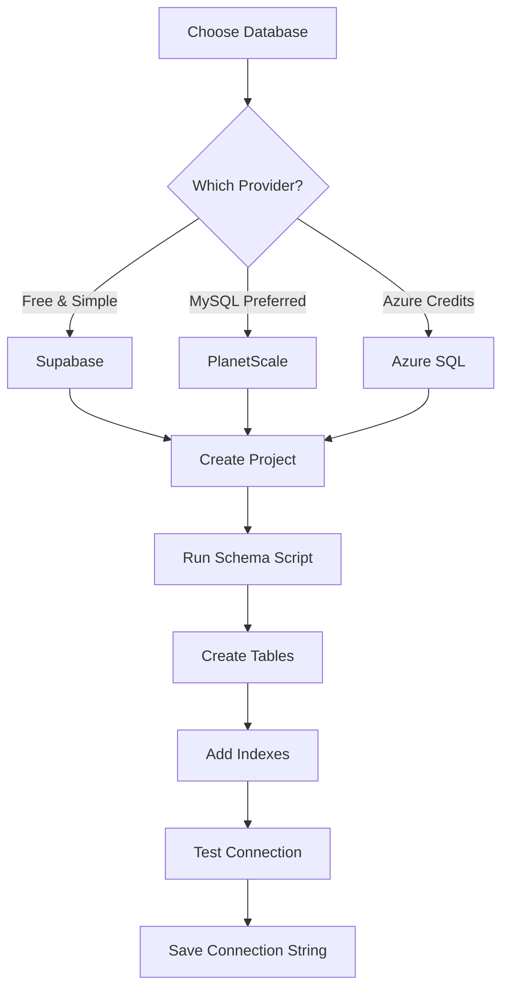

**Supabase Setup (Recommended for Free Tier):**

1. **Create Project**
   - Go to Supabase dashboard
   - Click "New Project"
   - Choose organization
   - Set database password
   - Select region (closest to users)
   - Wait for provisioning (~2 minutes)

2. **Run Schema Script**
   - Navigate to SQL Editor
   - Create sessions table with indexes
   - Create transactions table with foreign keys
   - Create insights table
   - Create processing_logs table
   - Run all CREATE statements

3. **Configure Access**
   - Go to Settings → API
   - Copy connection string (PostgreSQL)
   - Note API URL and anon key
   - Save in environment variables

4. **Test Connection**
   - Use SQL Editor to verify tables
   - Insert test record
   - Verify cascade delete works
   - Check index performance

**PlanetScale Setup (Alternative):**

1. **Create Database**
   - Sign up at PlanetScale
   - Create new database
   - Choose region
   - Select free plan (5GB storage)

2. **Setup Schema**
   - Use web console
   - Create tables via SQL
   - Add indexes
   - Test relationships

3. **Get Connection Strings**
   - Navigate to Connect tab
   - Copy connection string
   - Note hostname, username, password
   - Save in environment file

### 3. Local Development Environment

**Project Structure Setup:**

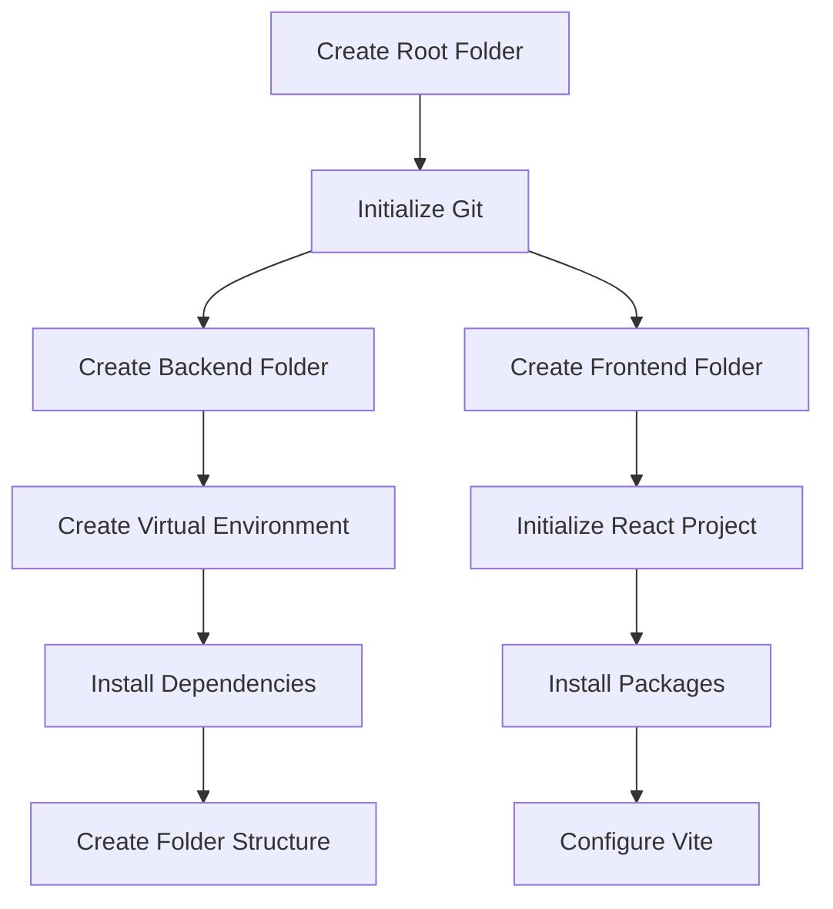

**Backend Setup Steps:**

1. **Create Backend Directory**
   - Name: `backend`
   - Create subdirectories: `src`, `tests`, `functions`
   - Within `src`: `api`, `application`, `domain`, `infrastructure`

2. **Setup Virtual Environment**
   - Create Python virtual environment
   - Activate environment
   - Install FastAPI, uvicorn, PyPDF2, pandas, openpyxl
   - Install azure-functions, azure-storage-blob, azure-servicebus
   - Install database driver (psycopg2 or pymysql)
   - Install pytest for testing

3. **Create Configuration Files**
   - Create `.env.example` with required variables
   - Create `requirements.txt`
   - Create `.gitignore` for Python
   - Create `Dockerfile` (optional)

4. **Implement Core Modules**
   - Domain layer: processors, models, interfaces
   - Application layer: services, DTOs
   - Infrastructure layer: repositories, external services
   - API layer: routes, middleware

**Frontend Setup Steps:**

1. **Initialize React Project**
   - Use Vite for React setup
   - Choose React + JavaScript template
   - Name: `frontend`

2. **Install Dependencies**
   - Install axios for HTTP requests
   - Install TailwindCSS for styling
   - Install react-router-dom (if multi-page)

3. **Create Component Structure**
   - Create `components` folder
   - Create `services` folder for API calls
   - Create `hooks` folder for custom hooks
   - Create `utils` folder for helpers

4. **Configure Environment**
   - Create `.env.development` file
   - Add API URL variable
   - Add PowerBI embed URL variable
   - Create `.env.production` for deployment

---

## PowerBI Configuration

### Dashboard Creation Workflow

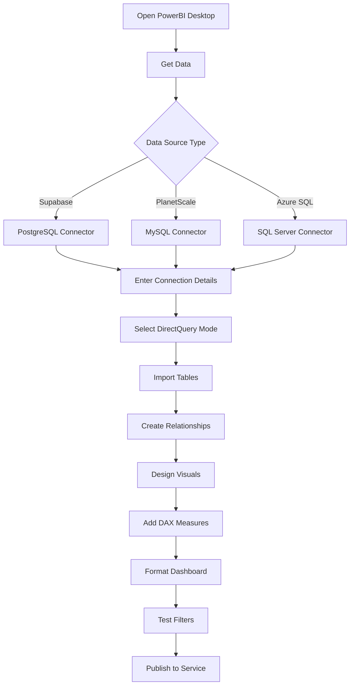

### Step-by-Step Dashboard Setup

**1. Connect to Database**

- Open PowerBI Desktop
- Click "Get Data" → Database type
- Enter server hostname
- Enter database name
- Choose authentication (usually username/password)
- Select "DirectQuery" mode (not Import)
- Click OK to connect

**2. Import Required Tables**

- Select tables: sessions, transactions, insights
- Preview data to verify
- Click "Load"
- Wait for metadata load (not actual data)

**3. Create Relationships**

- Go to Model view
- Drag session_id from transactions to sessions
- Verify relationship type (many-to-one)
- Repeat for insights table
- Set cross-filter direction to "Both"

**4. Design Dashboard Layout**

**Top Section (KPI Cards):**
- Total Credits card
- Total Debits card
- Net Cash Flow card
- Transaction Count card

**Middle Section (Charts):**
- Line chart: Daily balance trend
- Bar chart: Category-wise spending
- Pie chart: Credit vs Debit ratio

**Bottom Section (Details):**
- Table: Top 10 transactions
- Slicer: Date range filter

**5. Create DAX Measures**

Create these calculated measures:
- Total Credits calculation
- Total Debits calculation
- Net Flow calculation
- Average Transaction calculation
- Category percentages

**6. Format Dashboard**

- Apply consistent color theme
- Add title and subtitle
- Set fonts and sizes
- Configure tooltips
- Test responsive layout
- Add page-level filters

**7. Publish to PowerBI Service**

**Publishing Steps:**

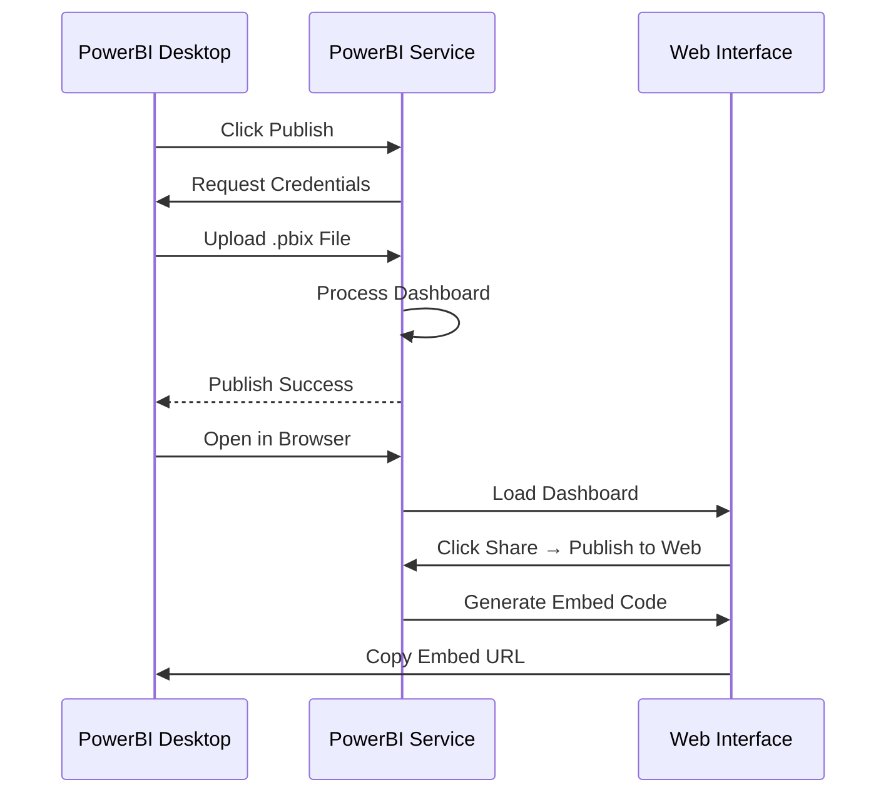

- Click "Publish" in PowerBI Desktop
- Select workspace (My Workspace for free tier)
- Wait for upload completion
- Click "Open in PowerBI Service"
- In browser, click on dataset
- Configure scheduled refresh (if needed)
- Go to File → Publish to Web
- Confirm public sharing warning
- Copy embed URL and iframe code
- Save embed URL in frontend environment variables

**8. Test Dashboard**

- Verify data appears correctly
- Test filters and slicers
- Check visualizations update
- Validate calculations
- Test on mobile view
- Verify embed link works

---

## Deployment Process

### Deployment Strategy Overview

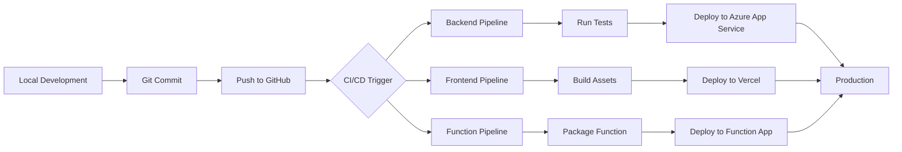

### Backend Deployment

**Azure App Service Deployment Steps:**

1. **Prepare for Deployment**
   - Ensure all tests pass locally
   - Update requirements.txt
   - Check environment variables
   - Test API endpoints locally
   - Commit all changes

2. **Manual Deployment (First Time)**
   - Login to Azure Portal
   - Navigate to App Service
   - Go to Deployment Center
   - Choose GitHub as source
   - Authorize GitHub access
   - Select repository and branch
   - Configure build settings (Python 3.10)
   - Save configuration

3. **Configure Environment Variables**
   - Go to App Service → Configuration
   - Add application settings:
     - DATABASE_URL
     - AZURE_STORAGE_CONNECTION_STRING
     - AZURE_SERVICE_BUS_CONNECTION_STRING
     - POWERBI_CLIENT_ID (if using API)
     - SESSION_TTL_MINUTES
   - Save and restart app

4. **Verify Deployment**
   - Check deployment logs
   - Visit API health endpoint
   - Test upload endpoint with Postman
   - Check Application Insights logs
   - Verify database connectivity

### Frontend Deployment

**Vercel Deployment Steps:**

1. **Prepare React App**
   - Run build locally to verify
   - Check for any build errors
   - Verify environment variables
   - Test production build locally
   - Commit changes

2. **Connect to Vercel**
   - Login to Vercel dashboard
   - Click "Add New Project"
   - Import from GitHub
   - Select repository
   - Verify framework (Vite detected automatically)

3. **Configure Build Settings**
   - Build Command: `npm run build`
   - Output Directory: `dist`
   - Install Command: `npm install`
   - Add environment variables:
     - VITE_API_URL
     - VITE_POWERBI_EMBED_URL

4. **Deploy**
   - Click "Deploy"
   - Wait for build completion (~2 minutes)
   - Visit provided URL
   - Test complete user flow
   - Check browser console for errors

### Azure Functions Deployment

**Function App Deployment Workflow:**

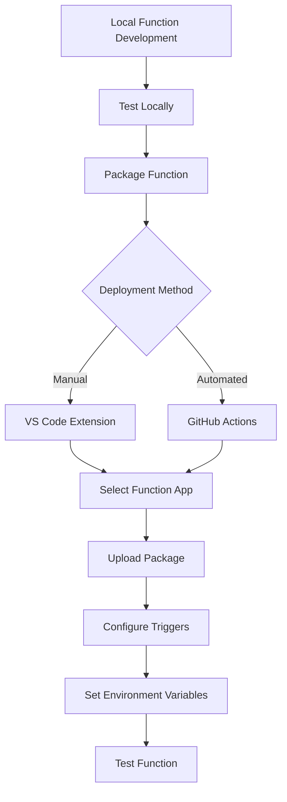

**Steps:**

1. **Package Functions**
   - Ensure host.json is configured
   - Check function.json for each function
   - Verify requirements.txt includes all dependencies
   - Test functions locally with Azurite

2. **Deploy Processing Function**
   - Use VS Code Azure Functions extension OR Azure CLI
   - Select Function App resource
   - Choose folder to deploy
   - Wait for deployment
   - Check deployment logs

3. **Configure Service Bus Trigger**
   - Verify connection string in settings
   - Check queue name matches
   - Test trigger with sample message
   - Monitor execution in Azure Portal

4. **Deploy Timer Function**
   - Deploy cleanup function
   - Verify CRON schedule (*/5 * * * * *)
   - Check function runs on schedule
   - Monitor execution logs

5. **Test End-to-End**
   - Upload file via frontend
   - Check blob storage for file
   - Verify message in Service Bus queue
   - Monitor function execution
   - Check database for inserted records
   - Verify cleanup after 30 minutes

### CI/CD Pipeline Setup

**GitHub Actions Workflow Configuration:**

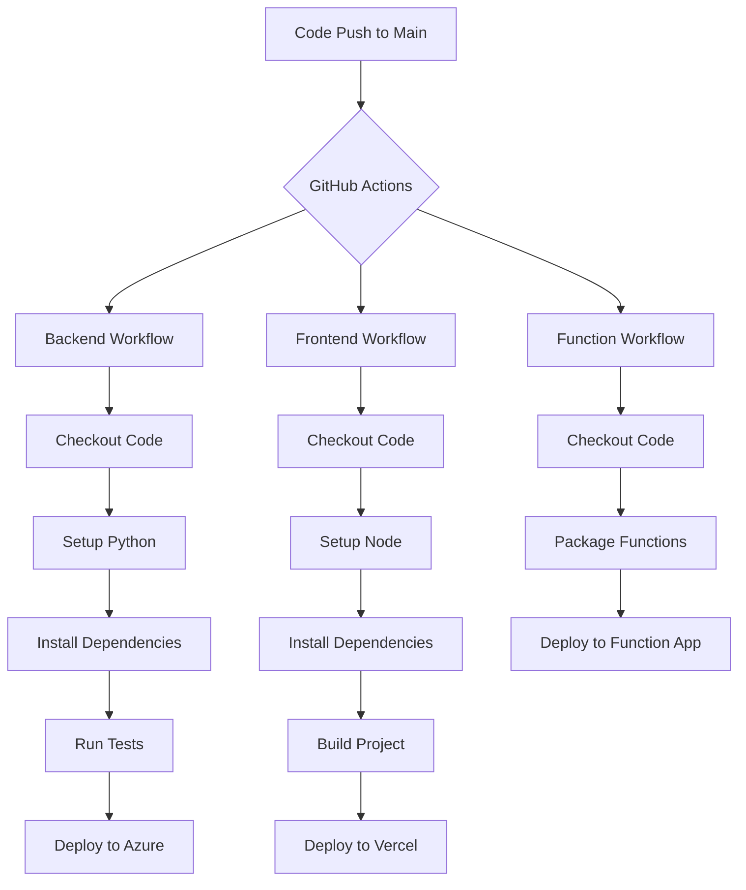

**Setup Steps:**

1. **Create GitHub Secrets**
   - Navigate to repository settings
   - Go to Secrets and Variables → Actions
   - Add secrets:
     - AZURE_WEBAPP_PUBLISH_PROFILE
     - AZURE_FUNCTION_PUBLISH_PROFILE
     - VERCEL_TOKEN
     - VERCEL_ORG_ID
     - VERCEL_PROJECT_ID

2. **Create Workflow Files**
   - Create `.github/workflows` folder
   - Create `backend-deploy.yml`
   - Create `frontend-deploy.yml`
   - Create `function-deploy.yml`

3. **Configure Workflows**
   - Define triggers (push to main branch)
   - Set up job steps
   - Configure deployment actions
   - Add notifications (optional)

4. **Test Workflows**
   - Make small code change
   - Commit and push
   - Monitor Actions tab
   - Verify all workflows complete
   - Check deployed applications

---

## Testing & Validation

### Testing Strategy

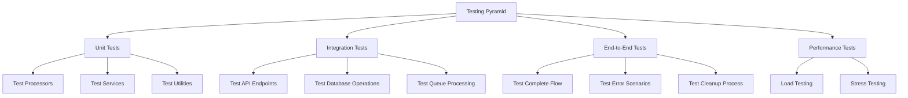

### Unit Testing

**Backend Unit Tests:**

1. **Test PDF Processor**
   - Test extraction with sample PDF
   - Verify data cleaning
   - Check transformation accuracy
   - Test categorization logic
   - Validate error handling

2. **Test CSV Processor**
   - Test CSV parsing
   - Verify column mapping
   - Check data type conversion
   - Test malformed CSV handling

3. **Test Excel Processor**
   - Test XLSX reading
   - Verify XLS compatibility
   - Check multi-sheet handling
   - Test large file processing

4. **Test Services**
   - Mock dependencies
   - Test upload service
   - Test cleanup service
   - Verify session management
   - Check error propagation

**Running Tests:**
- Setup pytest configuration
- Run all unit tests
- Check code coverage (aim for 80%+)
- Review failed tests
- Fix issues and re-run

### Integration Testing

**API Integration Tests:**

1. **Upload Endpoint**
   - Test valid file upload
   - Test invalid file types
   - Test file size limits
   - Test missing file
   - Verify session creation

2. **Session Status Endpoint**
   - Test valid session retrieval
   - Test non-existent session
   - Test expired session
   - Verify status updates

3. **Delete Session Endpoint**
   - Test manual deletion
   - Verify blob cleanup
   - Check database cleanup
   - Test already deleted session

**Database Integration Tests:**

1. **CRUD Operations**
   - Test session creation
   - Test transaction insertion
   - Test bulk insert performance
   - Test cascade deletes
   - Verify indexes work

2. **Query Performance**
   - Test session retrieval
   - Test transaction filtering
   - Test insight calculations
   - Measure query times
   - Optimize slow queries

### End-to-End Testing

**Complete User Flow Test:**

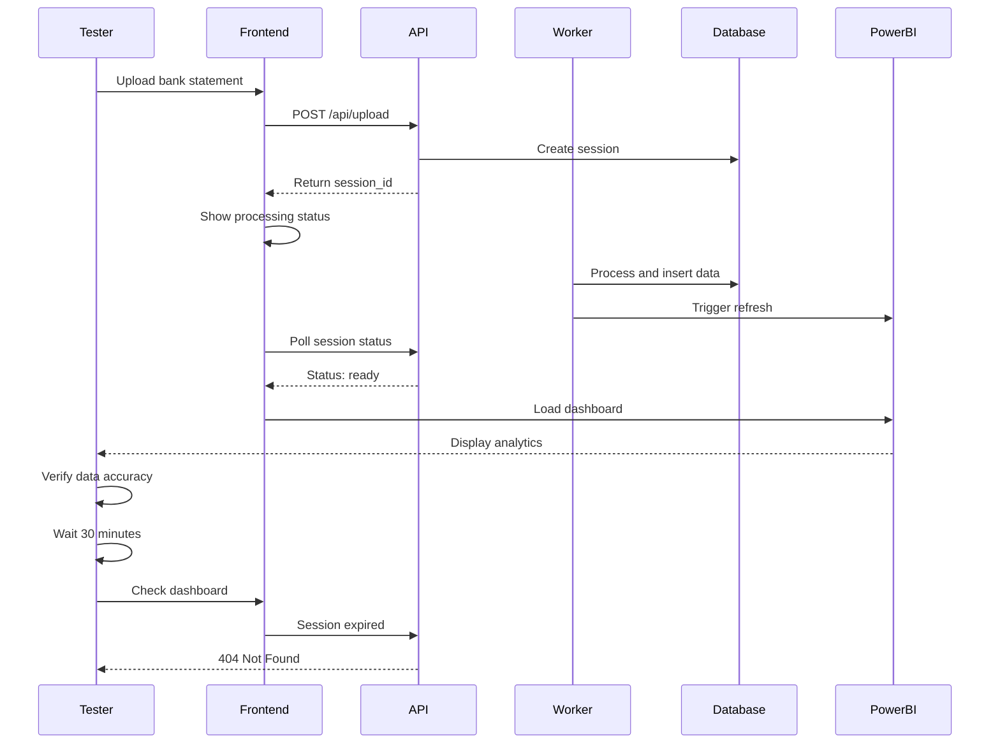

**Test Scenarios:**

1. **Happy Path**
   - Upload valid PDF statement
   - Wait for processing
   - Verify dashboard appears
   - Check all visualizations
   - Verify calculations correct
   - Test manual delete
   - Confirm data removed

2. **Error Scenarios**
   - Upload invalid file type → Should show error
   - Upload corrupted PDF → Should handle gracefully
   - Upload oversized file → Should reject
   - Network interruption during upload → Should recover
   - Database connection failure → Should show error

3. **Edge Cases**
   - Upload at midnight (date handling)
   - Upload with special characters in filename
   - Multiple rapid uploads
   - Session expires during processing
   - PowerBI service down

### Performance Testing

**Load Testing Setup:**

1. **Install Load Testing Tools**
   - Install Locust or Apache JMeter
   - Create test scenarios
   - Configure virtual users
   - Set ramp-up period

2. **Define Test Scenarios**
   - Concurrent uploads: 10, 50, 100 users
   - File sizes: Small (100KB), Medium (1MB), Large (5MB)
   - Duration: 5 minutes sustained load
   - Measure response times
   - Track error rates

3. **Run Tests**
   - Start with 10 concurrent users
   - Gradually increase load
   - Monitor API response times
   - Check function execution times
   - Observe database performance
   - Track memory and CPU usage

4. **Analyze Results**
   - Identify bottlenecks
   - Check average response times (should be < 3s)
   - Verify error rate (should be < 1%)
   - Review resource utilization
   - Document findings

**Performance Optimization:**

- Optimize database queries with indexes
- Add caching where appropriate
- Compress large responses
- Use connection pooling
- Optimize file parsing logic
- Consider CDN for frontend

---

## Monitoring Setup

### Application Insights Configuration

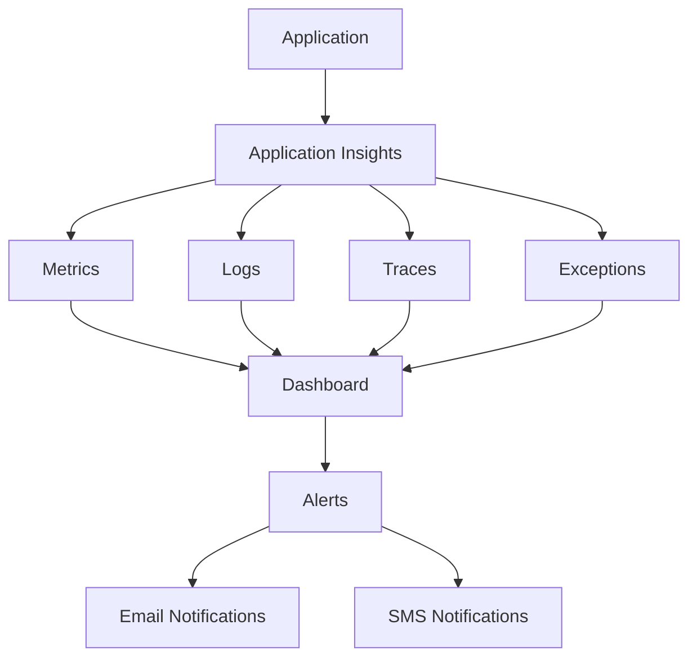

### Setup Steps

**1. Create Application Insights Resource**

- Go to Azure Portal
- Create new Application Insights resource
- Name: `bank-analyzer-insights`
- Link to resource group
- Note Instrumentation Key
- Note Connection String

**2. Configure Backend Monitoring**

- Install opencensus-ext-azure library
- Add instrumentation key to environment variables
- Initialize Application Insights in main.py
- Add custom logging throughout application
- Log important events (upload, processing start/end, errors)

**3. Configure Function Monitoring**

- Application Insights automatically enabled
- Verify logging works
- Add custom telemetry
- Track execution times
- Log processing results

**4. Configure Frontend Monitoring (Optional)**

- Add Application Insights JavaScript SDK
- Track page views
- Track custom events (upload clicked, dashboard viewed)
- Monitor client-side errors

### Key Metrics to Monitor

**API Metrics:**
- Request rate (requests per minute)
- Response time (average, 95th percentile)
- Error rate (4xx, 5xx responses)
- Availability percentage

**Function Metrics:**
- Execution count
- Execution duration
- Success rate
- Memory usage

**Database Metrics:**
- Query performance
- Connection pool usage
- Deadlocks
- Storage usage

**Business Metrics:**
- Total uploads per day
- Processing success rate
- Average processing time
- Sessions created vs completed

### Alert Configuration

**Critical Alerts:**

1. **API Down Alert**
   - Condition: Availability < 95% for 5 minutes
   - Action: Email + SMS to admin
   - Severity: Critical

2. **High Error Rate**
   - Condition: Error rate > 5% for 10 minutes
   - Action: Email to dev team
   - Severity: Warning

3. **Function Failures**
   - Condition: 3 consecutive failures
   - Action: Email notification
   - Severity: Error

4. **Database Connection Issues**
   - Condition: Connection errors detected
   - Action: Immediate email
   - Severity: Critical

**Setup Alert Rules:**
- Go to Application Insights → Alerts
- Click "New alert rule"
- Define condition
- Add action group (email/SMS)
- Set severity level
- Save alert rule

### Dashboard Creation

**Create Custom Dashboard:**

1. **Overview Dashboard**
   - Total requests today
   - Average response time
   - Error rate chart
   - Active sessions count

2. **Performance Dashboard**
   - Response time distribution
   - Database query times
   - Function execution times
   - Resource utilization

3. **Business Dashboard**
   - Uploads per hour/day
   - Processing success rate
   - Average file size
   - User geography (if tracked)

---

## Production Upgrade Path

### Free Tier to Production Migration

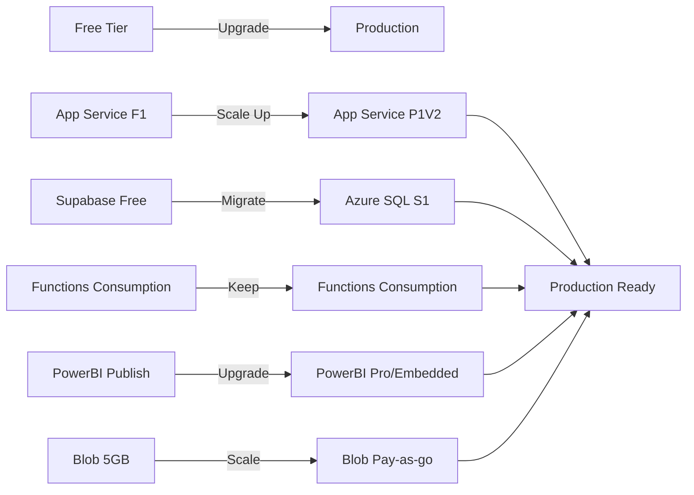

### When to Upgrade

**Indicators You Need Production Tier:**

- Receiving 100+ uploads per day
- Response times > 3 seconds consistently
- Free tier storage nearly full
- Need private PowerBI dashboards
- Require 99.9% SLA
- Need custom domain with SSL
- Require scaling capabilities
- Need advanced security features

### Component-by-Component Upgrade

**1. App Service Upgrade**

**From:** F1 Free (60 minutes CPU/day, 1GB RAM)
**To:** P1V2 Premium ($73/month)

**Benefits:**
- 24/7 availability
- 3.5GB RAM
- Auto-scaling
- Custom domains
- Deployment slots (staging/production)
- 99.95% SLA

**Migration Steps:**
- Go to App Service → Scale Up
- Select P1V2 tier
- Click Apply
- Monitor during change
- Verify application works
- Test scaling rules

**2. Database Upgrade**

**From:** Supabase Free (500MB, limited connections)
**To:** Azure SQL S1 ($15/month)

**Benefits:**
- 20 DTU performance
- Point-in-time restore
- Geo-replication
- Advanced security
- 99.99% SLA

**Migration Steps:**
- Create Azure SQL database (S1 tier)
- Export data from Supabase using pg_dump
- Import data to Azure SQL
- Update connection strings in all applications
- Test database connectivity
- Update PowerBI connection
- Monitor performance
- Decommission Supabase after verification

**3. PowerBI Upgrade**

**From:** Publish to Web (Free, public only)
**To:** PowerBI Pro ($10/user/month) OR Embedded A1 ($1/hour = $730/month)

**PowerBI Pro Benefits:**
- Private dashboards
- Share with specific users
- Row-level security
- More frequent refresh
- Larger dataset limits

**PowerBI Embedded Benefits:**
- White-label branding
- Embed in any application
- Pay-per-use pricing
- Full API control
- No user limits

**Recommendation:** Start with PowerBI Pro for cost efficiency, upgrade to Embedded only if scaling to hundreds of users.

**Migration Steps:**
- Purchase PowerBI Pro license
- Re-publish dashboard to Pro workspace
- Configure sharing permissions
- Update embed URL (if using Pro)
- OR provision Embedded capacity (if using Embedded)
- Test embed functionality
- Update frontend embed code if needed

**4. Storage Upgrade**

**From:** Blob 5GB free
**To:** Pay-as-you-go (Same tier, just pay for usage)

**Cost:** ~$0.02 per GB/month for hot tier

**No migration needed** - automatically scales beyond free tier.

**5. Service Bus Upgrade**

**From:** Basic (Free)
**To:** Standard ($10/month) - Only if needed

**Upgrade only if:**
- Need topics (not just queues)
- Need message sessions
- Need duplicate detection
- Need larger message sizes (256KB vs 1MB)

**For this project:** Basic tier is sufficient even in production.

### Cost Comparison Table

| Component | Free Tier | Production Tier | Monthly Cost |
|-----------|-----------|-----------------|--------------|
| App Service | F1 Free | P1V2 Premium | $73 |
| Database | Supabase Free | Azure SQL S1 | $15 |
| Functions | Consumption (Free 1M) | Consumption | ~$5 |
| Blob Storage | 5GB Free | Pay-as-go (10GB) | $0.20 |
| Service Bus | Basic (Free) | Basic | $0 |
| PowerBI | Publish to Web | Pro (per user) | $10 |
| Application Insights | 5GB Free | Pay-as-go | ~$2 |
| **Total** | **$0** | **~$105/month** |

### Scaling Strategy

**Phase 1: 0-100 users/day**
- Stay on free tier
- Monitor metrics

**Phase 2: 100-500 users/day**
- Upgrade App Service to B1 ($13/month)
- Keep free database if sufficient
- Monitor storage usage

**Phase 3: 500-1000 users/day**
- Upgrade to P1V2 App Service
- Migrate to Azure SQL
- Upgrade PowerBI to Pro
- Setup auto-scaling

**Phase 4: 1000+ users/day**
- Consider PowerBI Embedded
- Add CDN for frontend
- Implement caching layer (Redis)
- Database read replicas

---

## Troubleshooting

### Common Issues and Solutions

**Issue Resolution Flow:**

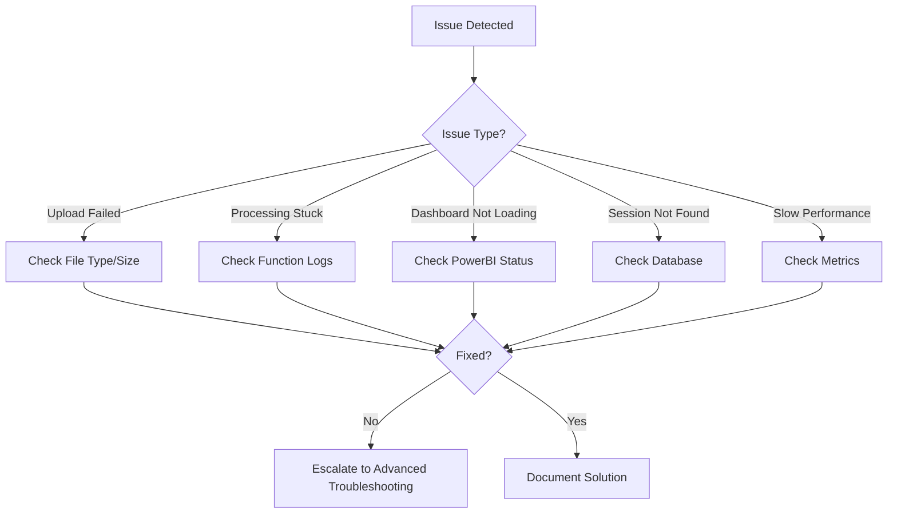

### Frontend Issues

**Problem: File upload fails with CORS error**

**Symptoms:**
- Browser console shows CORS error
- Network tab shows preflight OPTIONS request failed
- Upload button stuck on "Processing..."

**Solution:**
- Check CORS configuration in FastAPI backend
- Verify allowed origins include frontend domain
- Ensure credentials are enabled
- Check for trailing slashes in URLs
- Redeploy backend after fixing

**Problem: Dashboard iframe not loading**

**Symptoms:**
- Blank iframe appears
- Console shows "Refused to display in a frame" error
- PowerBI embed URL not working

**Solution:**
- Verify PowerBI embed URL is correct
- Check if dashboard is still published
- Confirm "Publish to Web" is enabled
- Try accessing URL directly in browser
- Regenerate embed code if needed
- Check iframe sandbox attributes

**Problem: Session timer shows negative time**

**Symptoms:**
- Timer displays negative minutes
- Timer counting in wrong direction

**Solution:**
- Check timezone handling in frontend
- Verify expires_at format from API
- Ensure Date parsing is correct
- Check if server and client time zones differ
- Convert all times to UTC

### Backend Issues

**Problem: API returns 500 Internal Server Error**

**Symptoms:**
- All endpoints return 500
- Application Insights shows exceptions
- Deployment succeeded but app not working

**Solution:**
- Check Application Insights for stack traces
- Verify all environment variables are set
- Check database connection string
- Verify Azure services are running
- Review startup logs in App Service
- Check requirements.txt has all dependencies
- Restart App Service

**Problem: Database connection timeout**

**Symptoms:**
- Requests timeout after 30 seconds
- Logs show "connection pool exhausted"
- Database queries never complete

**Solution:**
- Check firewall rules allow App Service IP
- Verify connection string is correct
- Check if database is running
- Increase connection pool size
- Check for long-running queries
- Verify database isn't at capacity

**Problem: File processing takes too long**

**Symptoms:**
- Session status stuck on "processing"
- Function times out
- Large files fail

**Solution:**
- Check function timeout setting (default 5 min)
- Increase timeout in host.json
- Optimize parsing logic
- Process large files in chunks
- Check if database inserts are slow
- Monitor function memory usage
- Consider premium function plan for larger files

### Azure Function Issues

**Problem: Function not triggering from Service Bus**

**Symptoms:**
- Message appears in queue
- Function never executes
- No logs in Application Insights

**Solution:**
- Check Service Bus connection string
- Verify queue name matches exactly
- Check function binding configuration
- Ensure Function App is running
- Review function logs for binding errors
- Test with manual trigger
- Verify Service Bus namespace is accessible

**Problem: Timer function not running on schedule**

**Symptoms:**
- Cleanup not happening
- Expired data still in database
- No execution logs at scheduled times

**Solution:**
- Verify CRON expression is correct (0 */5 * * * *)
- Check if Function App is in "Always On" mode (required for timer)
- Upgrade to Premium plan if needed
- Check Application Insights for execution history
- Manually trigger to test logic
- Verify timezone for CRON schedule

**Problem: Function runs but throws exceptions**

**Symptoms:**
- Function executes but fails
- Errors in Application Insights
- Some data processed, some not

**Solution:**
- Review exception stack trace
- Check if all required services are accessible
- Verify environment variables
- Test processing logic locally
- Add try-catch blocks for better error handling
- Check for null reference errors
- Validate input data format

### PowerBI Issues

**Problem: Dashboard shows "No data available"**

**Symptoms:**
- Dashboard loads but empty
- Visuals show no data
- DirectQuery connection fails

**Solution:**
- Check database connection in PowerBI Service
- Verify data exists in database tables
- Refresh credentials in PowerBI Service
- Check if session_id filter is working
- Test connection in PowerBI Desktop
- Verify DirectQuery mode is enabled
- Check firewall allows PowerBI IPs

**Problem: Dashboard not refreshing with new data**

**Symptoms:**
- Old data appears
- New uploads not reflected
- Manual refresh doesn't work

**Solution:**
- Verify DirectQuery is enabled (not Import)
- Check if scheduled refresh is configured
- Manually trigger dataset refresh
- Check PowerBI Service dataset status
- Verify database connection is active
- Check if data gateway is needed (for on-premise)
- Refresh browser cache

**Problem: Embed URL returns 404**

**Symptoms:**
- Iframe shows 404 error
- Embed link broken
- Dashboard was working before

**Solution:**
- Check if dashboard still published
- Verify workspace permissions
- Regenerate publish-to-web link
- Update embed URL in environment variables
- Redeploy frontend with new URL
- Check PowerBI Service status

### Database Issues

**Problem: Cascade delete not working**

**Symptoms:**
- Session deleted but transactions remain
- Foreign key constraint errors
- Cleanup incomplete

**Solution:**
- Verify ON DELETE CASCADE is set
- Check foreign key constraints exist
- Manually run DELETE to test
- Review database schema
- Recreate foreign keys with CASCADE
- Check if triggers interfere

**Problem: Query performance degraded**

**Symptoms:**
- Slow API responses
- Dashboard loading slowly
- Database CPU high

**Solution:**
- Check if indexes exist and are used
- Analyze slow query logs
- Run EXPLAIN on slow queries
- Add missing indexes
- Consider query optimization
- Check for table locks
- Archive old data

**Problem: Connection pool exhausted**

**Symptoms:**
- "Too many connections" error
- New requests hang
- Existing requests timeout

**Solution:**
- Increase max connections in database
- Implement connection pooling in app
- Close connections properly
- Check for connection leaks
- Reduce connection timeout
- Scale database tier

### Performance Issues

**Problem: Slow upload response**

**Symptoms:**
- Upload takes >10 seconds
- Frontend timeout errors
- Large files especially slow

**Solution:**
- Stream upload instead of loading to memory
- Increase upload size limits
- Check network bandwidth
- Optimize file validation
- Use multipart upload for large files
- Check if blob storage is throttled

**Problem: High memory usage in functions**

**Symptoms:**
- Function crashes with out-of-memory
- Large files fail
- Memory increases over time

**Solution:**
- Process files in chunks
- Use streaming for large files
- Clear variables after use
- Optimize pandas operations
- Increase function memory allocation
- Consider premium function plan

**Problem: API response time >5 seconds**

**Symptoms:**
- Slow page loads
- Frontend feels sluggish
- Users complaining

**Solution:**
- Add caching layer (Redis)
- Optimize database queries
- Enable compression
- Use CDN for static assets
- Implement pagination
- Review API endpoint logic
- Check database connection pooling

### Debugging Tools

**1. Azure Portal**
- Check resource health
- View metrics and logs
- Monitor resource usage
- Review alerts

**2. Application Insights**
- View live metrics
- Search logs
- Analyze exceptions
- Track dependencies

**3. VS Code**
- Debug functions locally
- Step through code
- Inspect variables
- Test with breakpoints

**4. Postman**
- Test API endpoints
- Debug requests/responses
- Validate data formats
- Test error scenarios

**5. Browser DevTools**
- Check network requests
- Debug JavaScript
- Monitor console errors
- Test responsive design

---

## Maintenance & Best Practices

### Regular Maintenance Tasks

**Daily:**
- Review error logs in Application Insights
- Check API health endpoint
- Monitor active sessions count
- Verify cleanup function executed

**Weekly:**
- Review performance metrics
- Check storage usage
- Analyze user patterns
- Review and clear old logs
- Update dependencies if security patches available

**Monthly:**
- Review and optimize costs
- Update libraries to latest versions
- Run full test suite
- Review and update documentation
- Backup database (if not auto-backup)
- Review PowerBI dashboard design

**Quarterly:**
- Security audit
- Performance review
- Capacity planning
- User feedback review
- Technology stack review

### Security Best Practices

**1. API Security**
- Keep dependencies updated
- Use HTTPS only
- Implement rate limiting
- Validate all inputs
- Sanitize file uploads
- Use secure headers

**2. Database Security**
- Use parameterized queries
- Encrypt connections
- Restrict network access
- Regular backups
- Audit access logs

**3. Azure Security**
- Use Managed Identities
- Enable Azure AD authentication
- Implement RBAC
- Use Key Vault for secrets
- Enable logging and monitoring
- Regular security reviews

**4. Data Privacy**
- Automatic data deletion (30 min)
- No permanent storage of financial data
- Encrypt data at rest
- GDPR compliance
- Clear privacy policy
- User consent for processing

### Backup Strategy

**What to Backup:**
- Database schema (not data - it's ephemeral)
- Application configuration
- PowerBI dashboard (.pbix file)
- Source code (in Git)
- Environment variables documentation
- Infrastructure as Code files

**Backup Schedule:**
- Source code: Continuous (Git)
- Database schema: Weekly export
- PowerBI file: After each modification
- Configuration: When changed

### Cost Optimization Tips

**1. Minimize Function Executions**
- Batch processing where possible
- Optimize trigger conditions
- Cache frequently accessed data
- Use efficient algorithms

**2. Database Optimization**
- Clean up test data
- Implement data archival
- Optimize queries
- Use appropriate tier

**3. Storage Management**
- Enable lifecycle policies
- Move old data to cool tier
- Delete orphaned blobs
- Monitor storage usage

**4. Monitoring Costs**
- Set spending alerts
- Review monthly costs
- Disable unused resources
- Use free tier where possible

### Documentation Maintenance

**Keep Updated:**
- API documentation (OpenAPI/Swagger)
- README.md with setup instructions
- Architecture diagrams
- Deployment procedures
- Troubleshooting guide
- Environment variables list

---

## Production Readiness Checklist

### Pre-Launch Checklist

**Infrastructure:**
- [ ] All Azure resources provisioned
- [ ] Database schema created and indexed
- [ ] Storage containers configured
- [ ] Service Bus queue created
- [ ] Functions deployed and tested
- [ ] API deployed and accessible
- [ ] Frontend deployed and accessible

**Configuration:**
- [ ] All environment variables set
- [ ] Connection strings verified
- [ ] CORS configured correctly
- [ ] Secrets stored in Key Vault
- [ ] SSL certificates configured
- [ ] Custom domain configured (optional)

**PowerBI:**
- [ ] Dashboard designed and tested
- [ ] Published to PowerBI Service
- [ ] Embed code generated
- [ ] DirectQuery mode verified
- [ ] Refresh schedule configured

**Testing:**
- [ ] Unit tests passing (80%+ coverage)
- [ ] Integration tests passing
- [ ] End-to-end tests passing
- [ ] Load testing completed
- [ ] Security testing done
- [ ] Cross-browser testing done

**Monitoring:**
- [ ] Application Insights configured
- [ ] Custom metrics added
- [ ] Alerts configured
- [ ] Dashboard created
- [ ] Log retention set
- [ ] Health checks enabled

**Documentation:**
- [ ] README.md complete
- [ ] API documentation available
- [ ] Deployment guide written
- [ ] Troubleshooting guide created
- [ ] Architecture documented
- [ ] User guide prepared

**Security:**
- [ ] HTTPS enforced
- [ ] Input validation implemented
- [ ] Rate limiting configured
- [ ] File upload restrictions in place
- [ ] Data deletion verified
- [ ] Secrets not in code

**Compliance:**
- [ ] Privacy policy published
- [ ] Data retention policy documented
- [ ] User consent mechanism
- [ ] GDPR compliance reviewed
- [ ] Terms of service available

### Post-Launch Checklist

**Week 1:**
- [ ] Monitor error rates daily
- [ ] Check performance metrics
- [ ] Review user feedback
- [ ] Verify cleanup working
- [ ] Check costs
- [ ] Fix critical bugs

**Week 2-4:**
- [ ] Analyze usage patterns
- [ ] Optimize performance bottlenecks
- [ ] Update documentation
- [ ] Plan feature enhancements
- [ ] Review security logs
- [ ] Stakeholder update

---

## Learning Resources

### Official Documentation

**Azure:**
- Azure Functions Python Guide
- Azure App Service Documentation
- Azure Storage Documentation
- Azure Service Bus Documentation
- Application Insights Guide

**PowerBI:**
- PowerBI Desktop Guide
- DirectQuery Documentation
- Publish to Web Guide
- PowerBI REST API Reference
- DAX Function Reference

**Development:**
- FastAPI Documentation
- React.js Official Docs
- Pandas Documentation
- PyPDF2 Documentation

### Recommended Courses

**For Beginners:**
- Microsoft Learn: Azure Fundamentals
- FastAPI Tutorial (Official)
- React.js Tutorial (Official)
- SQL Basics Course

**For Intermediate:**
- Azure Solutions Architect Path
- Python for Data Engineering
- Advanced React Patterns
- PowerBI for Developers

**For Advanced:**
- Azure DevOps Engineering
- Microservices Architecture
- Performance Optimization
- Security Best Practices

---

## Project Extensions & Future Enhancements

### Phase 1 Extensions (Easy)

**1. Multi-Bank Format Support**
- Add more PDF parsing patterns
- Support for different CSV formats
- Automatic bank detection
- Format configuration file

**2. Enhanced Categorization**
- Machine learning for categories
- User-defined categories
- Smart categorization rules
- Category suggestions

**3. Email Notifications**
- Processing complete notification
- Error notifications
- Expiry warnings
- Weekly summaries

### Phase 2 Extensions (Medium)

**1. User Accounts**
- Authentication system
- User dashboard
- History of past analyses
- Saved preferences

**2. Advanced Analytics**
- Month-over-month comparison
- Spending trends
- Budget tracking
- Anomaly detection

**3. Export Features**
- Download processed data as CSV
- Export dashboard as PDF
- Email report option
- Custom date ranges

### Phase 3 Extensions (Advanced)

**1. Multi-Currency Support**
- Currency detection
- Exchange rate integration
- Multi-currency dashboards
- Historical exchange rates

**2. Predictive Analytics**
- Future spending predictions
- Budget recommendations
- Savings suggestions
- Investment insights

**3. API for Third-Party Integration**
- Public API endpoints
- API key management
- Webhook support
- Rate limiting

---

## Conclusion

### What You've Built

A **production-grade financial analytics platform** that demonstrates:
- Modern cloud architecture
- Real-world data processing
- Business intelligence integration
- Privacy-first design
- Industry best practices

### Skills Demonstrated

**Technical:**
- Full-stack development (React + FastAPI)
- Cloud infrastructure (Azure)
- Database design and optimization
- Asynchronous processing
- ETL pipelines
- API development
- CI/CD implementation

**Professional:**
- Clean architecture
- Design patterns
- Testing strategies
- Documentation
- Security practices
- Cost optimization
- Performance tuning

### Portfolio Value

This project showcases:
- **Real-world problem solving**: Processing financial data
- **Modern tech stack**: React, FastAPI, Azure, PowerBI
- **Production deployment**: Live application on cloud
- **Best practices**: Testing, monitoring, security
- **Business value**: Actionable insights from data

### Next Steps for Career Growth

**For Job Seekers:**
1. Deploy this project live
2. Add to GitHub with comprehensive README
3. Create demo video
4. Write blog post about implementation
5. Present at meetups or conferences
6. Add to resume with metrics (uptime, performance)

**For Students:**
1. Complete all testing phases
2. Add advanced features
3. Document learnings
4. Share with university
5. Use for final project
6. Request recommendations

**For Career Switchers:**
1. Master all components
2. Understand each design decision
3. Practice explaining architecture
4. Build related projects
5. Network with developers
6. Apply to relevant positions

### Key Takeaways

**Architecture:**
- Event-driven systems scale better
- Separation of concerns improves maintainability
- Clean architecture pays off in long run

**Cloud Services:**
- Free tiers sufficient for learning and MVP
- Monitoring essential from day one
- Cost management important early

**Development:**
- Tests save time debugging
- Documentation crucial for maintenance
- CI/CD enables rapid iteration

**Business:**
- Privacy builds trust
- Performance impacts user experience
- Analytics drive better decisions

---

## Support & Resources

### Getting Help

**Community:**
- Stack Overflow (tag: fastapi, azure, powerbi)
- Reddit: r/azure, r/webdev, r/Python
- Discord: FastAPI server, Azure community

**Official Support:**
- Azure Support (free tier available)
- GitHub Issues (for libraries)
- Microsoft Q&A

### Contributing

If this project helped you:
- Star the repository
- Share with others
- Report bugs
- Suggest improvements
- Contribute code
- Write tutorials

### License

This implementation guide is provided as educational material. Adapt freely for learning and professional use.

---

## Quick Reference

### Essential Commands

**Azure CLI:**
- `az login` - Authenticate to Azure
- `az group create` - Create resource group
- `az webapp deploy` - Deploy application
- `az functionapp deployment` - Deploy function

**Development:**
- `python -m venv venv` - Create virtual environment
- `pip install -r requirements.txt` - Install dependencies
- `uvicorn main:app --reload` - Run FastAPI locally
- `npm run dev` - Run React locally

**Testing:**
- `pytest` - Run backend tests
- `pytest --cov` - Run with coverage
- `npm test` - Run frontend tests

**Deployment:**
- `git push origin main` - Trigger CI/CD
- `vercel --prod` - Deploy frontend
- `az webapp restart` - Restart API

### Important URLs

**Development:**
- Local API: http://localhost:8000
- Local Frontend: http://localhost:5173
- API Docs: http://localhost:8000/docs

**Production:**
- API: https://bank-analyzer-api.azurewebsites.net
- Frontend: https://your-app.vercel.app
- PowerBI: https://app.powerbi.com

### Key Metrics Targets

- API Response Time: < 2 seconds
- Upload Processing: < 30 seconds
- Function Execution: < 5 minutes
- Error Rate: < 1%
- Uptime: > 99%

---

**Document Version:** 1.0  
**Last Updated:** December 2025  
**Project Status:** Production Ready  
**Estimated Implementation Time:** 4 weeks
